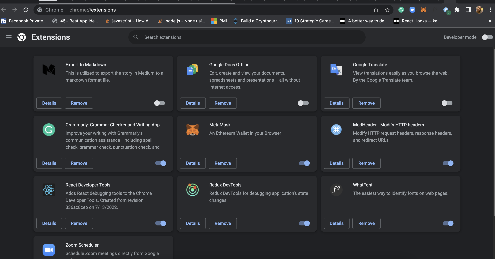
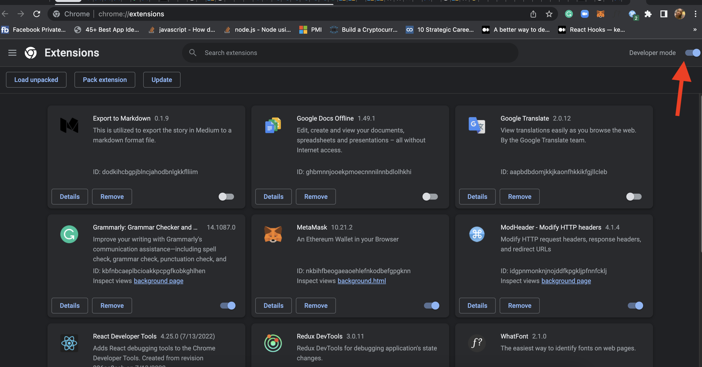
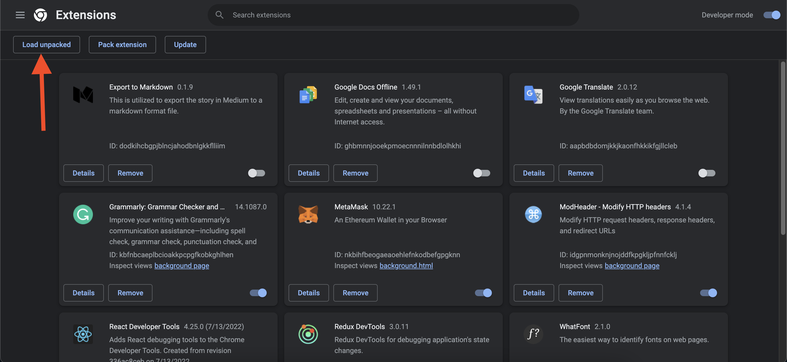
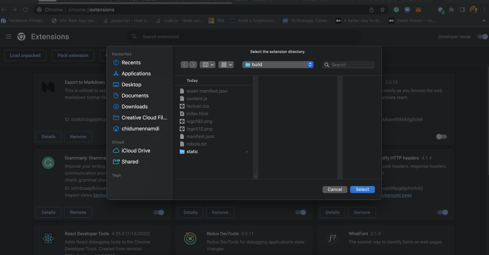
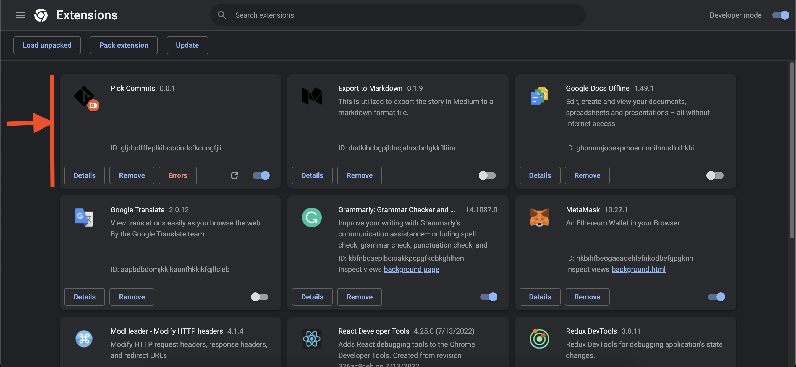
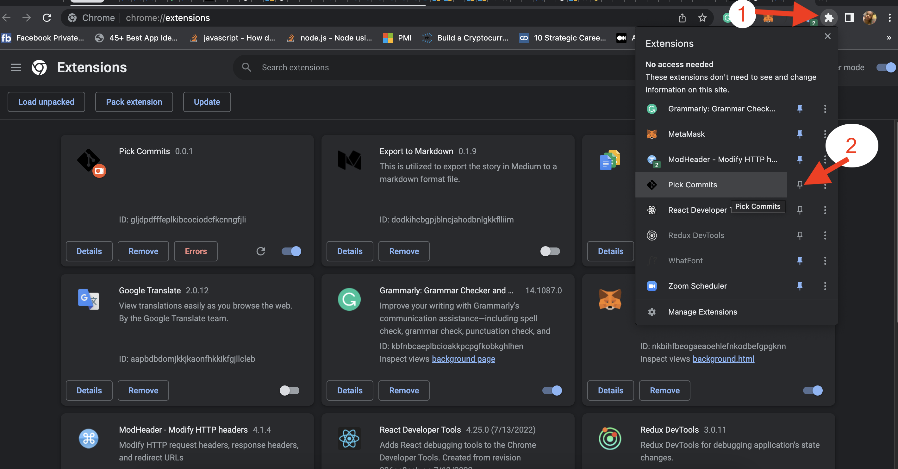
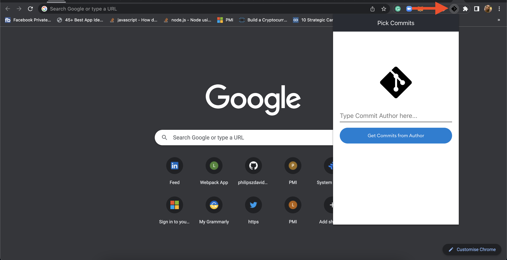

# Pick Commits

A Chrome Extension that picks author's commits from a BitBucket PR.

# Installation and Usage

Git clone this repo `git clone https://github.com/philipszdavido/pick-commits.git`

Open your Chrome Browser

Open Chrome Extensions page: `chrome://extensions/`

On the top-right of the page, check the "Developer mode" to on.

On the top-left, click on "Load unpacked", and then select the `build` folder in this repo we cloned.

The extension is loaded.

Pin the extension to the extension bar.

Click on the extension icon (Git logo), you will see the extension popout appear. This is where you type in the name of the author you want to get all his commits:

Load a PR page, and type the name of author you want to collect the commits and see magic.
